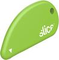

## Will's Official Stationery List

### Pens
| Manufacturer | Type | Width | Ink Colour |
| -- | -- | -- |  -- |
| Kaweco | AL Sport Red | 0.7 | Black |
| Schneider | One Business | 0.6 | Black |
| Schneider | One Hybrid N | 0.5 | Blue |
| Muji | Gel Ink Ballpoint | 0.3 | Black |

### Pencils
| Manufacturer | Type | Width | Lead Density |
| -- | -- | -- |  -- |
| Rotring | 800 | 0.5 | 2B |
| Kaweco | Clutch - Copper | 3.6 | 2B |
| Lyra | Ferby | 3.6 | HB |

### Higlighters & Markers
| Manufacturer | Type | Colour |
| -- | -- | -- | 
| Sharpie | Fine Point |  Black |
| Stabilo | Luminator XT | Green |

### Paper & Notebook
| Manufacturer | Type | Size | Colour |
| -- | -- | -- |  -- |
| Rexel | ColourHide | A5 | Blue |
| Field Notes | Left Handed |  |  |
| Post-It | Super Sticky | 6 Pack | Traditional Yellow |
| Grovemade | Desk Pad |  | Black |

### Other
| Manufacturer | Type | Detail |
| -- | -- | -- |
| Croxley | Rubber Bands | Nr 32 100gr |
| Paper Pro | Nano Stapler |  |
| Olfa | Craft Knife | 26B |
| Brother | Label Printer | PT300 |
| Slice | Ceramic Cutter |  |
| Smidt | Roller Ball Refill | P8126 |
    <!--  -->